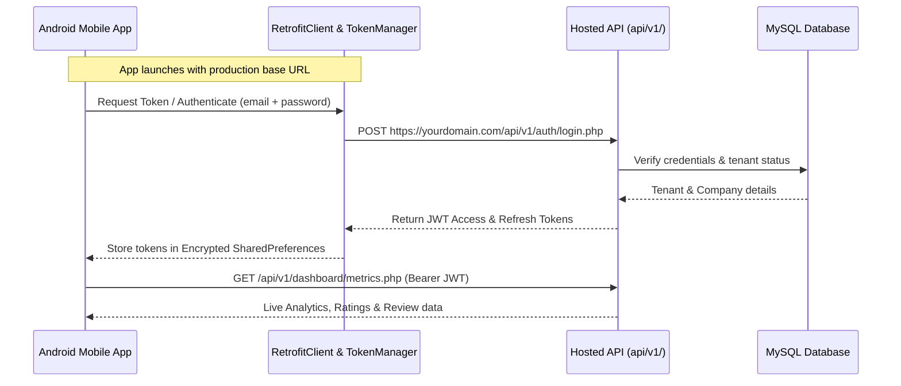

# Optibiz Platform Deployment & Google Play Store Guide

This comprehensive manual guides you through:
1. **Hosting & Deploying the Web Application & REST API** on your live production server (cPanel, Cloud VPS, or Dedicated Server).
2. **Connecting the Optibiz Android Mobile App to your Hosted Live API**.
3. **Packaging, Signing, and Publishing the Android App on the Google Play Store**.

---

## Part 1: Hosting the Web Application & REST API

### 1.1 Server Prerequisites
Ensure your production hosting environment meets the following specifications:
- **Operating System**: Linux (Ubuntu, Debian, AlmaLinux, Rocky Linux, or cPanel on CentOS)
- **Web Server**: Apache 2.4+ (with `mod_rewrite`, `mod_headers`, `mod_deflate`, `mod_expires` enabled) or Nginx with PHP-FPM
- **PHP Version**: PHP 8.1, 8.2, or 8.3
- **Required PHP Extensions**:
  `mysqli`, `curl`, `mbstring`, `fileinfo`, `openssl`, `json`, `gd`, `zip`
- **Database**: MySQL 8.0+ or MariaDB 10.4+

---

### 1.2 File Upload & Directory Permissions
1. Upload all files from the project root (`c:\xampp\htdocs\rate`) to your web root (for example, `/home/username/public_html` or `/var/www/html/rate`).
   > [!IMPORTANT]
   > Do **NOT** upload local test databases or the `.git` folder. The included `.htaccess` automatically denies public access to `backups/`, `migrations/`, `tools/`, and dotfiles.

2. Set proper filesystem permissions on Linux/cPanel:
   ```bash
   # Make uploads directory writable by web server
   chmod -R 775 uploads/
   chmod -R 775 backups/
   ```

---

### 1.3 Database Setup
1. Create a MySQL database and user in your hosting control panel (e.g., cPanel MySQL Database Wizard):
   - **Database Name**: `yourdb_optibiz`
   - **Database User**: `yourdb_user`
   - **Database Password**: A strong, unique password
2. Import the schema file [`database.sql`](file:///c:/xampp/htdocs/rate/database.sql) using phpMyAdmin or the MySQL CLI:
   ```bash
   mysql -u yourdb_user -p yourdb_optibiz < database.sql
   ```
3. Run any outstanding migrations in [`migrations/`](file:///c:/xampp/htdocs/rate/migrations/) if you are upgrading an older database:
   ```bash
   php migrations/migrate_google_reviews.php
   php migrations/migrate_notifications.php
   php migrations/migrate_payments.php
   php migrations/migrate_whatsapp.php
   ```

---

### 1.4 Environment Configuration (`.env`)
1. In the application root on your server, copy `.env.example` to create `.env`:
   ```bash
   cp .env.example .env
   ```
2. Edit `.env` with your live credentials:
   ```ini
   # Environment: 'production' ensures display_errors is OFF and logs are enabled
   APP_ENV=production
   APP_BASE_URL=https://yourdomain.com

   # Database Credentials
   OPTIBIZ_DB_HOST=localhost
   OPTIBIZ_DB_USER=yourdb_user
   OPTIBIZ_DB_PASS=YourStrongSecurePasswordHere!
   OPTIBIZ_DB_NAME=yourdb_optibiz

   # REST API & Mobile JWT Security (MANDATORY: Minimum 32 random characters)
   OPTIBIZ_JWT_SECRET=c8f2a9e1d4b740528e6c7391a24d85601b3e5f7a9c2d4e6f8b0a1c3e5d7f9a2b

   # Allowed Origins for REST API (comma-separated origins)
   OPTIBIZ_API_ALLOWED_ORIGINS=https://yourdomain.com,https://app.yourdomain.com
   ```
3. Secure the file permissions so other users on shared hosting cannot read it:
   ```bash
   chmod 600 .env
   ```

---

### 1.5 SSL & Security Headers
1. Install an SSL/TLS Certificate (e.g. Free Let's Encrypt via cPanel AutoSSL or Certbot).
2. The platform's `.htaccess` already includes security headers:
   - `X-Content-Type-Options: nosniff`
   - `X-XSS-Protection: 1; mode=block`
   - `Referrer-Policy: strict-origin-when-cross-origin`
3. Verify that requests automatically redirect from `http://` to `https://`.

---

### 1.6 Outgoing SMTP Email Setup
Customer verifications, quote responses, invoices, and password resets require functioning SMTP:
1. Log in to the Superadmin panel: `https://yourdomain.com/superadmin/login.php`  
   *(Default username: `superadmin`, password: `superadmin123` — change this immediately)*.
2. Go to **Settings** -> **Email & SMTP Settings**.
3. Choose **SMTP (Authenticated TLS/SSL)**:
   - **SMTP Host**: e.g., `smtp.mailgun.org`, `smtp.sendgrid.net`, or `smtp.gmail.com`
   - **SMTP Port**: `587` (TLS) or `465` (SSL)
   - **SMTP Encryption**: `TLS`
   - **SMTP Username**: Your email provider username
   - **SMTP Password**: Your email provider API key or app password
   - **From Name**: Optibiz Support
   - **From Email**: `notifications@yourdomain.com`
4. Click **Send Test Email** to verify deliverability to an external inbox.

---

### 1.7 Payment Webhooks (Paystack / Flutterwave)
Log in to your payment provider dashboards and register the live webhook endpoints:
- **Paystack Dashboard** -> Settings -> API Keys & Webhooks:  
  `https://yourdomain.com/api/payment_webhook.php?gateway=paystack`
- **Flutterwave Dashboard** -> Settings -> Webhooks:  
  `https://yourdomain.com/api/payment_webhook.php?gateway=flutterwave`

---

### 1.8 Automated Background Tasks (Cron Job)
Add a cron job in cPanel or Linux crontab (`crontab -e`) to purge expired rate-limiting locks and stale sessions once daily:
```bash
0 0 * * * php -r "require '/path/to/public_html/config/database.php'; \$conn->query('DELETE FROM api_rate_limits WHERE reset_at < UNIX_TIMESTAMP()');" > /dev/null 2>&1
```

---

## Part 2: Linking the Optibiz Android App to the Hosted API

The Optibiz Android application communicates with the backend via the REST API (`api/v1/`). When running locally, it defaults to the emulator address `http://10.0.2.2:8080/rate/api/v1/`. Follow these steps to switch it to your live production server.



### 2.1 Pre-Flight API Verification
Before modifying the Android code, verify that your live API endpoint is responding properly.
Run this command from your computer terminal (replacing `yourdomain.com` with your actual domain):

```bash
curl -i https://yourdomain.com/api/v1/auth/login.php
```
- **Expected response**: `HTTP/1.1 405 Method Not Allowed` or JSON `{ "success": false, "message": "Method Not Allowed" }` (because login requires a POST request).
- If you receive `HTTP 503 Service Unavailable`, ensure `OPTIBIZ_JWT_SECRET` is set in your server's `.env` and has at least 32 characters.
- If you receive `HTTP 404 Not Found`, ensure you included the subfolder if hosted in a subfolder (e.g. `https://yourdomain.com/rate/api/v1/auth/login.php`).

---

### 2.2 Update the Base URL in the Android Project

Open the Android project in **Android Studio** or locate the file:
[`optibiz/app/src/main/java/com/example/data/remote/TokenManager.kt`](file:///c:/xampp/htdocs/rate/optibiz/app/src/main/java/com/example/data/remote/TokenManager.kt)

1. Locate lines 24–26 in `TokenManager.kt`:
   ```kotlin
   companion object {
       ...
       // Default to Android emulator loopback to host port 8080
       const val DEFAULT_BASE_URL = "http://10.0.2.2:8080/rate/api/v1/"
   }
   ```
2. Replace it with your production HTTPS URL.
   > [!IMPORTANT]
   > Retrofit **requires** a trailing slash `/` at the end of the base URL!

   ```kotlin
   companion object {
       ...
       // Production Hosted REST API Endpoint:
       const val DEFAULT_BASE_URL = "https://yourdomain.com/api/v1/"
       // (Or "https://yourdomain.com/rate/api/v1/" if installed in a subdirectory)
   }
   ```

---

### 2.3 Enforce Strict HTTPS in Android Manifest

Open [`optibiz/app/src/main/AndroidManifest.xml`](file:///c:/xampp/htdocs/rate/optibiz/app/src/main/AndroidManifest.xml):

1. Find line 16:
   ```xml
   android:usesCleartextTraffic="true"
   ```
2. For production release, change it to `false`:
   ```xml
   android:usesCleartextTraffic="false"
   ```
   This ensures Google Play security checks pass and all mobile traffic is strictly encrypted over TLS/HTTPS.

---

### 2.4 Verify Mobile App Connectivity
1. Run the app in Android Studio on a physical device or emulator.
2. Enter your tenant or user credentials and sign in.
3. Verify that:
   - Login succeeds and receives the JWT access token.
   - Dashboard metrics, rating charts, and customer reviews load live data from your server.

---

## Part 3: Building & Publishing on Google Play Store

Google Play requires all new apps to be published in the **Android App Bundle (`.aab`)** format and signed with a cryptographic upload key.

---

### 3.1 Configure App Identity & Versioning

Open [`optibiz/app/build.gradle.kts`](file:///c:/xampp/htdocs/rate/optibiz/app/build.gradle.kts):

```kotlin
android {
    namespace = "com.example"
    compileSdk = 36

    defaultConfig {
        // Change to your official unique package identifier (e.g. com.optibiz.reviews)
        applicationId = "com.aistudio.optibiz.rvwp"
        minSdk = 24
        targetSdk = 36
        versionCode = 1        // Increment by 1 for each update (1, 2, 3...)
        versionName = "1.0.0"  // User-facing version string
        
        testInstrumentationRunner = "androidx.test.runner.AndroidJUnitRunner"
    }
```

---

### 3.2 Generate Your Cryptographic Release Keystore

The upload keystore signs your app bundle so Google Play knows updates come from you.
Open a terminal in the `optibiz` directory and run the Java `keytool` utility:

```bash
keytool -genkey -v -keystore my-upload-key.jks -alias upload -keyalg RSA -keysize 2048 -validity 10000
```
- Enter a secure password (e.g. `YourKeystorePass123!`).
- Answer the prompts for your organization name and location.
- This creates the file `my-upload-key.jks` in your `optibiz` folder.

> [!CAUTION]
> **BACK UP `my-upload-key.jks` IN A SAFE, OFFLINE LOCATION!**  
> If you lose this keystore or forget the password, you will not be able to publish updates to your app on Google Play.

---

### 3.3 Set Signing Environment Variables & Build the App Bundle

In your terminal or build environment, set the passwords for the keystore:

**On Windows (PowerShell):**
```powershell
$env:KEYSTORE_PATH = "$PWD\my-upload-key.jks"
$env:STORE_PASSWORD = "YourKeystorePass123!"
$env:KEY_PASSWORD = "YourKeystorePass123!"
```

**On macOS / Linux:**
```bash
export KEYSTORE_PATH="$(pwd)/my-upload-key.jks"
export STORE_PASSWORD="YourKeystorePass123!"
export KEY_PASSWORD="YourKeystorePass123!"
```

Now, build the signed release bundle:
```bash
# Windows
.\gradlew.bat bundleRelease

# macOS / Linux
./gradlew bundleRelease
```

The signed `.aab` file will be generated at:
```
optibiz/app/build/outputs/bundle/release/app-release.aab
```
This `.aab` file is what you will upload to Google Play Console.

---

### 3.4 Google Play Console Account Setup

1. **Sign up**: Go to [play.google.com/console](https://play.google.com/console) and create a Google Play Developer Account ($25 one-time registration fee).
2. **Identity Verification**: Complete Google's developer identity verification (passport or national ID, and D-U-N-S number if registering as an organization).

---

### 3.5 Create App Listing on Google Play Console

1. In Play Console, click **Create app**:
   - **App Name**: `Optibiz` (or your chosen brand name)
   - **Default language**: English (United States or your primary language)
   - **App or game**: App
   - **Free or paid**: Free
2. Complete the mandatory **App Content** declarations:
   - **Privacy Policy**: Enter the URL to your hosted privacy policy (e.g. `https://yourdomain.com/privacy.php`).
   - **App Access**: Provide a demo username and password so Google's review team can log in to test the app.
   - **Ads**: Select "No, my app does not contain ads".
   - **Content Ratings**: Complete the questionnaire (Ratings category: Utility/Productivity).
   - **Target Audience**: Select ages 18 and over.
   - **Data Safety**:
     - Declare that the app collects **Personal Info** (Name and Email for accounts and reviews) and **Photos** (if customers upload receipt/review images).
     - Declare that all data is **encrypted in transit over HTTPS**.
     - Declare that users can request account or data deletion.

---

### 3.6 Prepare Store Listing Graphic Assets

Prepare the required graphical assets for your Google Play Store listing:

| Asset Type | Specifications | Requirements |
| :--- | :--- | :--- |
| **App Icon** | 512 x 512 px | 32-bit PNG, max 1MB, no transparency |
| **Feature Graphic** | 1024 x 500 px | JPEG or 24-bit PNG, no alpha, max 15MB |
| **Phone Screenshots** | Min. 2 screenshots | 16:9 or 9:16 aspect ratio, between 320px and 3840px |
| **Short Description** | Up to 80 characters | Highlighting the review management feature |
| **Full Description** | Up to 4,000 characters | Explaining business review capture, Google review booster, analytics |

---

### 3.7 Upload the Bundle & Launch

1. Go to **Release** -> **Production** (or start with **Closed Testing** to test with friends or team members first).
2. Click **Create new release**.
3. Under **App bundles**, drag and drop your generated:  
   `optibiz/app/build/outputs/bundle/release/app-release.aab`
4. Enter **Release notes** (e.g., `Initial release of Optibiz review management app`).
5. Click **Next** -> **Review and roll out**.
6. Submit the release for review.

Google typically reviews and approves apps within **2 to 7 days**. Once approved, your app is live on Google Play worldwide!

---

## Part 4: Publishing Future Updates

Whenever you make improvements to the mobile app:
1. Open [`optibiz/app/build.gradle.kts`](file:///c:/xampp/htdocs/rate/optibiz/app/build.gradle.kts).
2. Increment `versionCode` by 1 (e.g., `versionCode = 2`).
3. Update `versionName` (e.g., `versionName = "1.0.1"`).
4. Run `.\gradlew.bat bundleRelease` to generate the new `.aab`.
5. In Play Console, go to **Production** -> **Create new release**, upload the new `.aab`, and submit for review.
